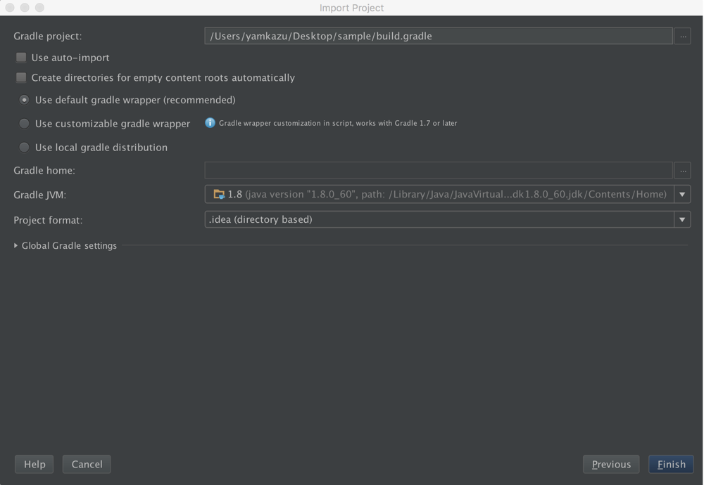

[今こそッ、始めようGrailsブートキャンプ!!!!](https://jggug.doorkeeper.jp/events/32330)の資材です。

# 環境の事前準備

## 必要なツール

* JDK
* Grails
* IntelliJ IDEA Community Edition(Ultimate Edition持っている方はそちらでもOK)

## Javaのインストール

2015年10月21日時点でセキュリティベースラインの最新であるJDK 8u60を使用します。
[ここ](http://www.oracle.com/technetwork/java/javase/downloads/index.html)からインストーラを取得してインストールしてください。

インストール後、JDKインストールディレクトリのbinディレクトリのパスをシステム環境変数のPATHに追加してください。

## Grailsのインストール

2015年10月21日時点で最新のGrails 3.0.9を使用します。
以下のいずれかの方法でインストールしてください。

### SDKMANを使ったインストール

Linux、OS Xといった環境ではSDKMANを使ったインストール方法がオススメです。
コマンドラインから以下を実行します。

SDKMANのインストール:
```
$ curl -s get.sdkman.io | bash
```

新しいシェルを開くか、以下を実行:
```
$ source "$HOME/.sdkman/bin/sdkman-init.sh"
```

Grailsをインストール:
```
$ sdk install grails 3.0.9
```

### ZIPファイルを使ったインストール

Windows環境などSDKMANを使えない環境ではこちらの方法でインストールしてください。

[ここ](https://grails.org/download.html)から`grails-3.0.9.zip`を取得して適当なディレクトリに展開します。

展開後、展開したディレクトリのbinディレクトリのパスをシステム環境変数のPATHに追加してください。

## IntelliJ IDEA Community Editionのインストール

[ここ](https://www.jetbrains.com/idea/download/)からインストーラを取得してインストールしてください。
基本デフォルト設定のままで問題ありません。

## Grailsの動作確認

コマンドラインから適当なディレクトリで以下を実行します。

新規プロジェクトの作成:
```
$ grails create-app sample
```

アプリケーションの起動:
```
$ cd sample
$ grails
grails> run-app
```

`grails`コマンドの初回実行時は必要なライブラリをインターネットからダウンロードするため、かなりの時間がかかります。
grailsのシェルが起動したあとに`run-app`コマンドでアプリケーションを起動すると以下のメッセージが表示されます。

```
Grails application running at http://localhost:8080 in environment: development
```

ブラウザで[http://localhost:8080](http://localhost:8080)にアクセスしてみてください。
以下のような画面が表示されればうまく起動しています。


アプリケーションを停止するには以下を実行します。

アプリケーションの停止:
```
grails> stop-app
grails> exit
```

## IntelliJ IDEAの動作確認

IntelliJ IDEAを起動すると以下のような画面が表示されます。


### JDKの設定

起動画面から[Configure]-[Project Defaults]-[Project Structure]を選択します。


[New...]-\[JDK\]を選択しJavaのインストールディレクトリを指定します。


登録できたら[OK]で終了します。

### プロジェクトのインポート

起動画面から[Import Project]を選択して、先ほど作成した作成した`sample`プロジェクトのディレクトリを指定して[OK]ボタンをクリックします。


Import Project画面で[Import project from external model]からGradleを選択して[Next]をクリックします。


そのままの設定で[Finish]ボタンをクリックします。



うまくインポートできると以下のような画面が表示されます。


